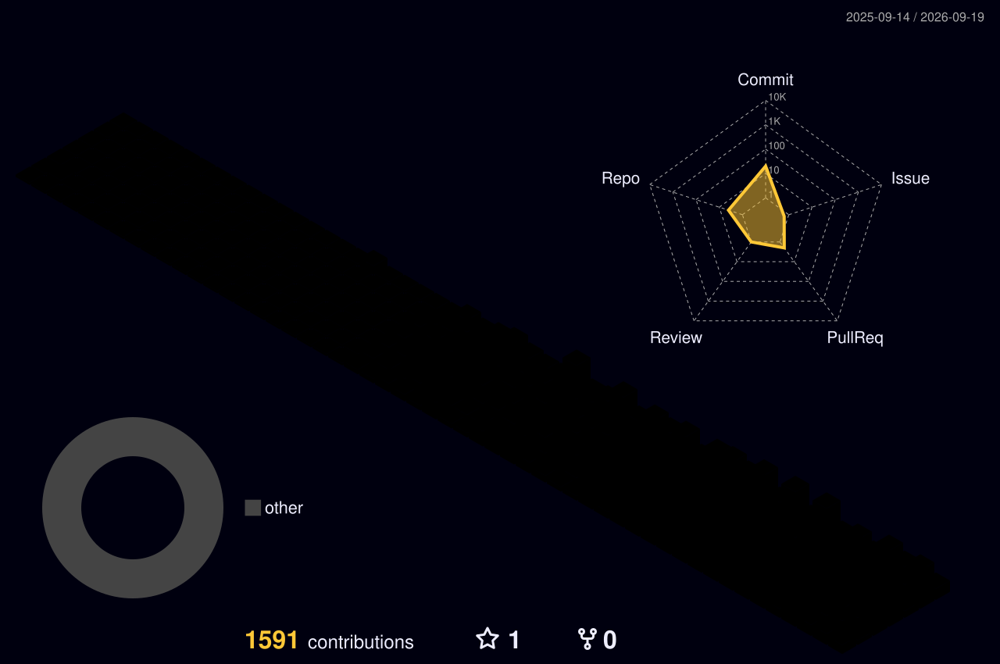

<div align="center">
  
</div>

<div align="center">
    
</div>

<div align="center">
  <a href="https://itskrushang.xyz/"></a>
  <a href="https://linkedin.com/in/krushang18"></a>
  <a href="https://instagram.com/Krushang_181"></a>
  <a href="mailto:krushangdesai18@gmail.com"></a>
</div>

<div align="center">
  
  
</div>

<br />

## SYSTEM PROFILE

```python
class KrushangDesai:
    role = "AI & Data Science Developer"
    mission = "Build intelligent, purposeful, human-centered products"
    next_level = "Generative AI Engineer"

    focus = [
        "Large Language Models",
        "Retrieval-Augmented Generation",
        "AI agents and automation",
        "Data science and intelligent web apps",
    ]

    current_strategy = "Think in systems. Ship in iterations. Learn in public."
    off_screen = "Calculating the next move on a 64-square battlefield"
```

> I enjoy connecting LLMs, data, and modern web technologies to solve real problems. Great software is part logic, part creativity - and, just like chess, timing matters.

## TECHNOLOGY MATRIX

<div align="center">
  
</div>

<br />

<div align="center">
  
  
  
  
  
  
</div>

## FEATURED COLLABORATION

<div align="center">
  <a href="https://github.com/Krushang1818/Crease">
    
  </a>
  <p><sub>React Native + Expo + Firebase platform for cricket clubs, match management, and real-time scoring.</sub></p>
</div>

## DEVELOPER TELEMETRY

<div align="center">
  
  
</div>


<div align="center">
  
</div>

## CONTRIBUTION ENGINE

<div align="center">
  <picture>
    <source media="(prefers-color-scheme: dark)" srcset="https://raw.githubusercontent.com/Krushang1818/Krushang1818/output/github-contribution-grid-snake-dark.svg" />
    <source media="(prefers-color-scheme: light)" srcset="https://raw.githubusercontent.com/Krushang1818/Krushang1818/output/github-contribution-grid-snake.svg" />
    
  </picture>
</div>

## 3D CONTRIBUTION UNIVERSE

<div align="center">
  
</div>

<div align="center">
  <h3>Build with purpose. Learn relentlessly. Play the long game.</h3>
  <code>AI x DATA x WEB x CHESS</code>
</div>


